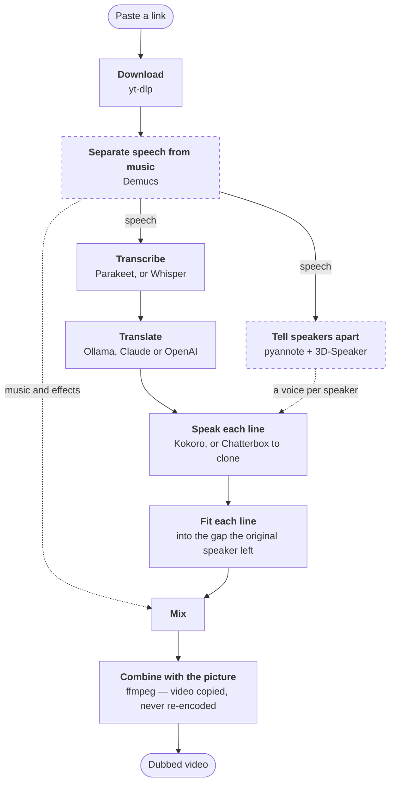

# Dubbing Studio

**Paste a video link. Get the video back speaking English.**

Everything runs on your own machine. No account, no upload, no subscription.

---

## Install

Open **Terminal** — press <kbd>⌘</kbd><kbd>Space</kbd>, type `Terminal`, press
return — then paste this and press return:

```bash
/bin/bash -c "$(curl -fsSL https://raw.githubusercontent.com/gready-hub/dubbing-studio/main/install.sh)"
```

That's it. It takes 10–20 minutes the first time, mostly downloading. You can
leave it and come back.

| | |
|---|---|
| **You'll be asked for** | your Mac password, once, when Homebrew installs |
| **You'll end up with** | **Dubbing Studio** in your Applications folder |
| **To update later** | run the same line again |
| **Needs** | macOS, an internet connection, and about 10–18 GB free — it picks a translation model to match your Mac's memory |

<details>
<summary>Prefer to install by hand?</summary>

Download the zip from GitHub, unzip it, and move the folder somewhere like
`/Users/you/Dubbing Studio` — **not** Downloads, Desktop, Documents or iCloud
Drive, which macOS blocks the app from reading. Then right-click
**Install.command**, choose **Open**, and click **Open** again in the dialog.

The Terminal line above exists to skip all of that. Files a browser downloads
are tagged by macOS as coming from an unidentified developer; files fetched by
`curl` are not, so there is no dialog. It also picks the folder for you.
</details>

---

## Use it

1. Open **Dubbing Studio**
2. Paste a video link
3. Press **Try 30 seconds** — or **Dub it** if you already know what you want

> **Try 30 seconds** dubs a short sample from where the speech starts, so you can
> hear the voice, the wording and the levels before committing to a long video.
> Liking it? One button turns it into the full dub, and the download isn't
> repeated.

Finished videos are saved to **Movies → Dubbed**. Samples are not — they play in
the app and nowhere else.

### The two questions on the front panel

| Question | Why it matters |
|---|---|
| **What kind of video is this?** | Locks specialist terms so they translate consistently. Built-in lists for crochet (US and UK), cooking and woodworking. Without one, the same stitch or ingredient comes out three different ways across a video. |
| **Who's speaking?** | *One person* is faster and can't mistake one presenter for several. Pick *Several people* for interviews — each gets their own voice. |

---

## How it works



Dashed stages are switchable — separation by the quality preset, speaker
detection by the **Who's speaking?** question.

**Timing** is the part that decides whether a dub feels right. Each translated
line is spoken, then fitted into the slot the original speaker used. A line too
long for its gap is compressed with a pitch-preserving filter up to 1.55×;
past that it runs over and the following pauses absorb it. Lines never start
before their original timestamp, so narration stays locked to the picture.

The quality report after each job says how much of that had to happen. Few
compressions and near-zero drift means a clean fit.

<details>
<summary>Where the work is kept, and what invalidates it</summary>

Every stage caches into the job folder, so re-running a link picks up where it
left off. Each artefact is keyed on the settings that produced it — reaching a
stale one is impossible rather than merely unlikely.

| Artefact | Re-made when you change |
|---|---|
| `source.mp4` | video quality |
| separated audio | quality, or whether separation ran |
| `segments.json` | the audio above, or the transcription engine |
| `translated.json` | the transcript, translator, model, target language, glossary |
| `lines/*.wav` | the translation, voice, speed, engine, speakers |

A job that succeeds drops its bulky intermediates and keeps the expensive ones —
transcript, translation, rendered lines. A job that **fails** keeps everything,
because that is when you re-run the link.
</details>

---

## Quality presets

| Preset | What it does | Speed |
|---|---|---|
| **Fast** | One voice, no separation | About the video's own length |
| **Balanced** *(default)* | Splits speech from music so the soundtrack survives | About 5× the video's length |
| **Best quality** | Also Whisper, and each speaker's voice cloned | Considerably slower |

Measured on an M1 with 16 GB using the local translation model. A newer Mac
beats this comfortably, and switching **Translated by** to an API key removes
the biggest chunk of time from every preset. The first video is slower still —
it fetches about 700 MB of speech models, one time only.

Start anything long and leave it. The Mac is held awake while there is work
queued, so a job doesn't stall at 40% because nobody touched the trackpad — the
screen may still sleep, only the machine is kept up. The **Won't sleep** pill
at the top says so, and switches it off.

> [!NOTE]
> Closing the lid sleeps regardless, whatever an app asks for. Leave it open, or
> plugged into an external display.

> [!NOTE]
> **On cloning.** It carries the speaker's accent across languages, which is
> usually what you want. For instructional content — where someone is following
> numbers or steps — a neutral built-in voice is often easier to understand.
> Cloning a real person's voice is also not the same act as picking a stock one.
> Fine privately; think about it before publishing.

---

## Settings

**Original audio**

| Option | Result |
|---|---|
| Replace completely | Cleanest listen; the original is gone |
| Keep quietly underneath | The usual documentary treatment — tone and background survive |
| Keep as a second track | Both in the file, switchable in VLC or IINA |

**Translated by**

| Option | Trade-off |
|---|---|
| Local model | Free, private, offline. Installed for you |
| Claude or OpenAI | Noticeably better on specialist material. A few pence per video |

> [!WARNING]
> An API key is stored in plain text at
> `~/Library/Application Support/DubbingStudio/settings.json`, readable only by
> your user account and never committed. It is not encrypted — anyone who can
> log in as you can read it. If that isn't an acceptable trade, leave the key
> blank and use the local model.

---

## Disk space

The **Disk space** panel breaks down everything the app is holding, with a bar
so the big one is obvious at a glance:

| | Typical | Safe to clear |
|---|---|---|
| Downloaded AI models | 3–6 GB | Yes — re-fetched when next needed |
| Translation model | 2.5–9 GB | Held by Ollama; remove it from there |
| Python environment | ~1.7 GB | Removed by Uninstall |
| Working files | grows per job | Yes — one video at a time, or all |
| Speech models | ~700 MB | Yes |
| Finished videos | yours | **Never touched by this app** |

A job is refused up front if there isn't room for it, with the numbers. An hour
of video needs roughly 6 GB while it runs; most of that is released when it
finishes.

---

## Uninstall

Double-click **Uninstall** in the app folder, or press **Uninstall…** in the
Disk space panel. It shows what it will delete, with sizes, and asks before
touching anything.

| | |
|---|---|
| **Removed** | The app, its Python environment, its models, settings, history and working files |
| **Kept** | Your dubbed videos in Movies → Dubbed |
| **Listed, not removed** | Homebrew, ffmpeg, yt-dlp, Ollama and its models |

That last row is the point: those are installed system-wide and other software
on your Mac may be using them. The uninstaller prints their sizes and the exact
command for each, and leaves the decision to you.

---

## Docker

For Windows, Linux, or handing to someone else:

```bash
cd docker
docker compose up --build
```

Then open <http://localhost:8765>. Finished videos land in `docker/output`.

> [!IMPORTANT]
> Docker cannot reach the Mac's GPU, so the container runs on CPU only and is
> roughly five times slower. Use an API key in Settings for the Docker version —
> a local translation model is impractical at that speed.

---

## When something goes wrong

Open **Setup check** in the app. It lists what's missing and the command to fix
it.

| Symptom | Cause |
|---|---|
| "Could not reach Ollama" | Open the Ollama app, wait a few seconds, try again |
| "Translation only returned N of M lines" | The local model is too small. Use a bigger one in Settings, or an API key |
| Downloads but nothing is heard | No speech in the video, or speech buried in loud music |
| More speakers found than really exist | Set **Who's speaking?** to *One person*, or say how many under Advanced |

Logs are at `~/Library/Logs/DubbingStudio.log`; each job keeps its working files
under `~/Library/Application Support/DubbingStudio/jobs`.

---

## Built on

| Stage | Tool |
|---|---|
| Download | yt-dlp |
| Separation | Demucs (htdemucs_ft) |
| Speaker detection | pyannote segmentation 3.0 + 3D-Speaker embeddings |
| Transcription | Parakeet TDT 0.6b v3 (25 languages), or Whisper large-v3 |
| Translation | a local Ollama model, or Claude / OpenAI |
| Synthesis | Kokoro-82M, or Chatterbox for cloned voices |
| Audio and video | ffmpeg |

On Apple Silicon the AI models run through **MLX**, Apple's GPU framework.
Everywhere else the same models run on CPU via **ONNX Runtime**, which is what
makes the Docker build possible.

The window is macOS's built-in WebView rather than a bundled browser, which is
why the app is a few megabytes rather than a few hundred.

---

## What you download

This fetches whatever link you give it, which makes it a question of what you're
entitled to download rather than what's technically possible. Downloading from
YouTube generally breaches their terms unless it's your own content, it's
offered for download, or the licence permits it. Dubbing someone's video also
creates a derivative work. Your call — worth making deliberately.
