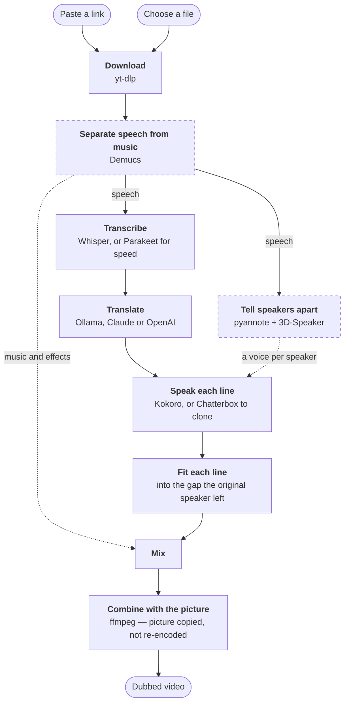

# Dubbing Studio

**Paste a video link, or pick a video off your Mac. Get it back speaking
English.**

Everything runs on your own machine. No account, no upload, no subscription.

---

## Install

Open **Terminal** — press <kbd>⌘</kbd><kbd>Space</kbd>, type `Terminal`, press
return — then paste this and press return:

```bash
/bin/bash -c "$(curl -fsSL https://raw.githubusercontent.com/gready-hub/dubbing-studio/main/install.sh)"
```

That's it. It takes 10–20 minutes the first time, mostly downloading. You can
leave it and come back.

| | |
|---|---|
| **You'll be asked for** | your Mac password, once, when Homebrew installs |
| **You'll end up with** | **Dubbing Studio** in your Applications folder |
| **To update later** | run the same line again |
| **Needs** | macOS, an internet connection, and about 10–18 GB free — it picks a translation model to match your Mac's memory |

<details>
<summary>Prefer to install by hand?</summary>

Download the zip from GitHub, unzip it, and move the folder somewhere that is
**not** Downloads, Desktop, Documents or iCloud Drive — macOS blocks the app
from reading those. Your home folder works. Then right-click
**Install.command**, choose **Open**, and click **Open** again in the dialog.

The Terminal line installs to `~/Library/Application Support/DubbingStudio/`
instead, which is where macOS expects an app to keep this and is never one of
the blocked locations.

The Terminal line above exists to skip all of that. Files a browser downloads
are tagged by macOS as coming from an unidentified developer; files fetched by
`curl` are not, so there is no dialog. It also picks the folder for you.
</details>

---

## Use it

1. Open **Dubbing Studio**
2. Paste a video link, or press **Choose a file…** and pick one off this Mac
3. Press **Try 30 seconds** — or **Dub it** if you already know what you want

> A file you choose is read where it sits. Nothing is copied, moved or changed,
> and the dub is written to **Movies → Dubbed** like any other.

> **Try 30 seconds** dubs a short sample from where the speech starts, so you can
> hear the voice, the wording and the levels before committing to a long video.
> Liking it? One button turns it into the full dub, and the download isn't
> repeated.

Finished videos land in **Movies → Dubbed**. The **Your dubbed videos** panel
lists recent ones with an **Open folder** button. Samples aren't saved —
they only play in the app.

### The two choices on the front panel

| Choice | Why it matters |
|---|---|
| **Quality** | How much work goes into the dub, and so how long it takes: *Fast*, *Balanced* or *Best quality*. Described in full further down. |
| **Who's speaking?** | *One person* is faster and can't mistake one presenter for several. Pick *Several people* for interviews — each gets their own voice. |

Everything else is in **Settings**, and stays as you left it from one video to the
next.

---

## How it works



Dashed stages are switchable — separation by the quality preset, speaker
detection by the **Who's speaking?** question.

**Timing** is the part that decides whether a dub feels right. Each translated
line is spoken, then fitted into the slot the original speaker used. A line too
long for its gap is compressed with a pitch-preserving filter up to 1.55×;
past that it runs over and the following pauses absorb it. Lines never start
before their original timestamp, so narration stays locked to the picture.

The quality report after each job says how much of that had to happen. Few
compressions and near-zero drift means a clean fit.

<details>
<summary>Where the work is kept, and what invalidates it</summary>

Every stage caches into the job folder, so running the same video again picks up
where it left off. A file of your own is identified by its path together with its
size and modification time, so re-exporting over the top of one starts a fresh
job rather than replaying the last one's transcript against the new footage. Each artefact is keyed on the settings that produced it — reaching a
stale one is impossible rather than merely unlikely.

| Artefact | Re-made when you change |
|---|---|
| `source.mp4` | video quality (a file of your own isn't copied, so there's none) |
| separated audio | quality, or whether separation ran |
| `segments.json` | the audio above, or the transcription engine |
| `translated.json` | the transcript, translator, model, target language, glossary |
| `lines/*.wav` | the translation, voice, speed, engine, speakers |

A job that succeeds drops its bulky intermediates and keeps the expensive ones —
transcript, translation, rendered lines. A job that **fails** keeps everything,
because that is when you re-run the link.
</details>

---

## Quality presets

> [!NOTE]
> **The finished file plays anywhere** — standard H.264 video and AAC audio in
> an MP4, the format every Mac, phone, browser and TV already opens.

| Preset | What it does | Speed |
|---|---|---|
| **Fast** | One voice, no separation | Quickest — it skips the longest stage |
| **Balanced** *(default)* | Splits speech from music so the soundtrack survives | Roughly 0.3–5× the video's length, depending on how much talking there is |
| **Best quality** | Each speaker's own voice cloned | Considerably slower |

All three presets, run back to back on the same real 9m25s video (Spanish,
with background music), on an M4 Pro:

| Stage | Fast | Balanced | Best |
|---|---|---|---|
| Download | 2.6s | 2.5s | 2.6s |
| Separate | – | 1m26s | 1m26s |
| Transcribe | 1m02s | 1m15s | 41s |
| Translate | 1m04s | 58s | 1m03s |
| Synthesize | 19s | 17s | 16m02s |
| Fit | 9s | 17s | 18s |
| Finish | 29s | 29s | 31s |
| **Total** | **3m09s** | **4m49s** | **20m06s** |

Every job's own quality report shows this same breakdown for the video you
just ran — that number is always the one to trust, not this table.

Long jobs are safe to leave running — the Mac stays awake until the queue is
empty. The **Won't sleep** pill at the top turns that off if you'd rather it
didn't.

> [!NOTE]
> Closing the lid still sleeps the Mac either way. Leave it open, or plugged
> into an external display.

> [!NOTE]
> **On cloning.** It carries the speaker's accent across languages — usually a
> plus, though a neutral built-in voice can be easier to follow for
> step-by-step instruction. Cloning a real person's voice is a different act
> from picking a stock one; worth a thought before publishing.

---

## Settings

**Original audio**

| Option | Result |
|---|---|
| Replace completely | Cleanest listen; the original is gone |
| Keep quietly underneath | The usual documentary treatment — tone and background survive |
| Keep as a second track | Both in the file, switchable in VLC or IINA |

**Translated by**

| Option | Trade-off |
|---|---|
| Local model | Free, private, offline. Installed for you |
| Claude or OpenAI | Noticeably better on specialist material. A few pence per video |

> [!WARNING]
> An API key is stored in plain text at
> `~/Library/Application Support/DubbingStudio/settings.json`. Anyone who can
> log into this Mac as you can read it.

**Crochet stitch names**

The same stitch is a US single crochet and a UK double crochet, and a video never
says which its viewer uses — so this is the one piece of terminology the app
cannot work out for itself. Choose the side of the Atlantic your own patterns come
from, or leave it on *Not a crochet video*. Everything else specialist is read off
the video itself, whatever the subject and whatever language it is spoken in, and
you can pin your own terms alongside it.

---

## Disk space

The **Disk space** panel breaks down everything the app is holding, with a bar
so the big one is obvious at a glance:

| | Typical | Safe to clear |
|---|---|---|
| Downloaded AI models | 3–6 GB | Yes — re-fetched when next needed |
| Translation model | 2.5–9 GB | Held by Ollama; remove it from there |
| Python environment | ~1.7 GB | Removed by Uninstall |
| Working files | grows per job | Yes — one video at a time, or all |
| Speech models | ~700 MB | Yes |
| Voice samples | a few MB | Yes — re-made on demand |
| Finished videos | yours | **Never touched by this app** |

A job is refused up front if there isn't room for it, with the numbers. An hour
of video needs roughly 6 GB while it runs; most of that is released when it
finishes.

---

## Uninstall

Press **Uninstall…** in the Disk space panel, or run **Uninstall.command**
from the app folder. It shows what it will remove, with sizes, and asks before
touching anything.

Everything it removes goes to the Bin rather than off the disk, so a change of
mind costs nothing — though the space only comes back when the Bin is emptied.
Your dubbed videos are never touched.

| | |
|---|---|
| **Removed** | The app, its Python environment, its models, settings, history and working files |
| **Kept** | Your dubbed videos in Movies → Dubbed |
| **Listed, not removed** | Homebrew, ffmpeg, yt-dlp, Ollama and its models |

Those are shared system-wide, so other software may depend on them — the
uninstaller lists their sizes and the exact command to remove each, and
leaves the choice to you.

---

## When something goes wrong

Open **Setup check** in the app. It lists what's missing and the command to fix
it.

| Symptom | Cause |
|---|---|
| "Could not reach Ollama" | Open the Ollama app, wait a few seconds, try again |
| "Translation only returned N of M lines" | The local model is too small. Use a bigger one in Settings, or an API key |
| Downloads but nothing is heard | No speech in the video, or speech buried in loud music |
| More speakers found than really exist | Set **Who's speaking?** to *One person* and run the link again |
| "YouTube described the video but refused to send it" | Set **Sign in as** in Settings to the browser you watch YouTube in. See below |

### When YouTube refuses the video

A refusal on the download after the lookup worked is usually throttling, and the
app retries on its own before saying anything. What it cannot retry past is a
video that wants a signed-in session — age-restricted, members-only, or simply
YouTube asking.

**Sign in as** in Settings takes the cookies from a browser you are already
signed into on this Mac. Nothing is uploaded; they go to YouTube and nowhere
else. It is off unless you choose a browser, because reading a cookie store is
not something to do quietly on someone's behalf.

If it still refuses, check yt-dlp is current — **Setup check** flags it when it
goes stale, and an out-of-date yt-dlp is the single commonest cause. Press
**Update yt-dlp** on that row to fetch a current one; it takes a few seconds and
does not re-run the rest of the setup. YouTube retires the player clients an
older copy knows about, and the symptom is specific: the video describes itself
happily, the download starts, and it stops part way in with a 403.

### Sending someone the details

**Copy details** in **Settings** (or next to **Try again** on a failed job)
copies your Mac, versions, setup check and recent activity as one block of
text — paste it to whoever's helping you. No passwords or API keys are in it.

If setup itself fails, the installer copies the same thing automatically.

<details>
<summary>Where that comes from, for anyone who prefers files</summary>

| | |
|---|---|
| App log | `~/Library/Logs/DubbingStudio.log` — one JSON record per line |
| Install log | `~/Library/Logs/DubbingStudio-install.log` |
| Settings and history | `~/Library/Application Support/DubbingStudio/` |
| The app itself | `~/Library/Application Support/DubbingStudio/program/` |
| Working files, models, voice samples | `~/Library/Caches/DubbingStudio/` |

The first pair can't be regenerated, so it's what a backup should keep. The
second is just re-downloadable cache — that's why Time Machine skips it and
macOS is free to reclaim it. The app log rotates at 5 MB and keeps three
files, so it never grows without limit.
</details>

---

## Built on

| Stage | Tool |
|---|---|
| Download | yt-dlp |
| Separation | Demucs (htdemucs_ft) |
| Speaker detection | pyannote segmentation 3.0 + 3D-Speaker embeddings |
| Transcription | Whisper large-v3, or Parakeet TDT 0.6b v3 for speed |
| Translation | a local Ollama model, or Claude / OpenAI |
| Synthesis | Kokoro-82M, or Chatterbox for cloned voices |
| Audio and video | ffmpeg |

On Apple Silicon the AI models run through **MLX**, Apple's GPU framework. Each
one also has a CPU version behind it, via **ONNX Runtime**, so a missing GPU
package costs speed rather than the job.

The window is macOS's built-in WebView rather than a bundled browser, which is
why the app is a few megabytes rather than a few hundred.

---

## What you download

This fetches whatever link you give it, which makes it a question of what you're
entitled to download rather than what's technically possible. (A file you choose
off your own Mac is downloaded from nowhere, so only the second half of this
applies to it.) Downloading from
YouTube generally breaches their terms unless it's your own content, it's
offered for download, or the licence permits it. Dubbing someone's video also
creates a derivative work. Your call — worth making deliberately.
